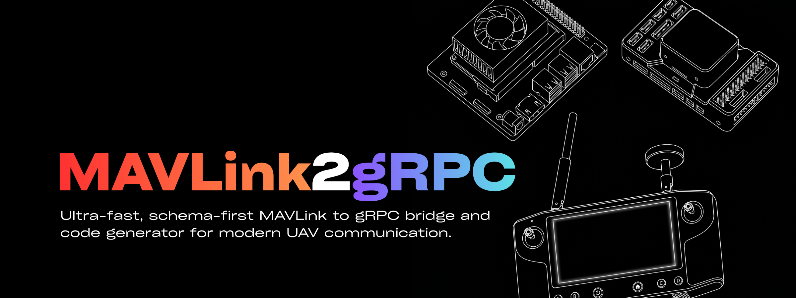

# MAVLink2gRPC



A high-performance, native bridge and code generator that exposes the entire MAVLink protocol as type-safe gRPC services using modern C++17.

Designed as a robust, type-safe alternative to [mavlink2rest](https://github.com/mavlink/mavlink2rest) for professional UAV systems.

## Documentation
Visit the official documentation site at **[setuav.github.io/mavlink2grpc](https://setuav.github.io/mavlibnk2grpc/)**.

Detailed documentation is also available locally under the `docs/` folder:
- [Getting Started Guide](docs/getting_started.md)
- [Architecture & Design](docs/architecture.md)
- [gRPC API Reference](docs/api_reference.md)
- [Client Libraries](docs/client_libraries.md)
- [Developer & Testing Guide](docs/developer_guide.md)

## Features
* **Schema-First:** Auto-generates Protobuf definitions (`.proto`) directly from MAVLink XMLs.
* **High Performance:** C++17 runtime bridge designed for low latency and efficient resource usage.
* **Polyglot:** Consume MAVLink telemetry in Python, Go, Rust, or Web clients via gRPC.
* **Real-time Streaming:** Bidirectional MAVLink message streaming with gRPC server-side streaming.
* **Web Inspector:** Built-in QGroundControl-style MAVLink inspector with live charts and frequency tracking.

## Project Structure

### `generator/`
Python-based code generator that converts MAVLink XML definitions to Protocol Buffer files and C++ conversion code. Uses Jinja2 templates to generate `.proto` files, gRPC service definitions, and C++ MAVLink↔Protobuf converters from XML message definitions.

### `bridge/`
C++17 MAVLink-to-gRPC bridge that connects to MAVLink devices (UDP/Serial) and exposes real-time bidirectional message streaming via gRPC. Implements connection management, message routing, and gRPC service (`StreamMessages`, `SendMessage`). Supports MAVSDK-style connection URLs like `udp://:14550` or `serial:///dev/ttyUSB0:57600`.

### `examples/inspector/`
QGroundControl-style web-based MAVLink inspector. Node.js backend (Express + Socket.IO) acts as gRPC client to the bridge and WebSocket server for the browser. Vanilla JavaScript frontend provides real-time message monitoring, frequency tracking, and multi-field chart visualization with Chart.js.

## Installation

### Requirements

- **C++:** C++17 compatible compiler, CMake 3.10+, gRPC, Protocol Buffers
- **Python:** 3.8+
- **Node.js:** 20+

### Setup
```bash
# Clone repository
git clone https://github.com/karakayahuseyin/mavlink2grpc.git
cd mavlink2grpc

# Run setup script (clones mavlink submodule, installs dependencies)
./setup.sh

# Build bridge (automatically runs the python generator and compiles the project)
mkdir build && cd build
cmake .. -DMAVLINK_DIALECT=common
make -j$(nproc)

# Install inspector dependencies
cd ../examples/inspector
npm install
```

## Usage

Start px4 or any MAVLink-compatible autopilot simulator (e.g., `px4_sitl`).

### Start Bridge
```bash
./build/bridge/mav2grpc_bridge -c udp://:14550 -g 0.0.0.0:50051
# Change connection string (-c) as needed
```

### Start Inspector Demo
```bash
cd examples/inspector
node server.js -g localhost:50051 -p 8000
```

Open browser: `http://localhost:8000`