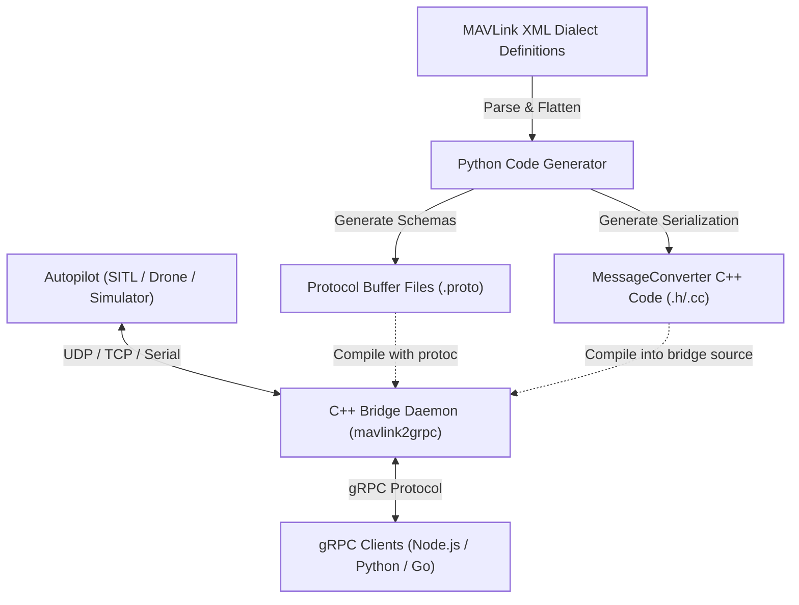

# Architecture & Design

This page describes the internal architecture of MAVLink2gRPC, detailing the code generation pipeline, the C++ runtime bridge, and the data serialization flow.

---

## High-Level Architecture

MAVLink2gRPC consists of two primary components: a **compile-time code generator** (written in Python) and a **run-time C++ bridge daemon**.

---

## Code Generation Pipeline

Because MAVLink contains hundreds of message definitions that vary based on dialects (e.g., ArduPilot, PX4), manual mapping would be error-prone and hard to maintain. MAVLink2gRPC solves this with a robust code generator.

1.  **Parsing XMLs:** The `MAVLinkParser` reads XML definitions, handles includes recursively, and parses all enums, messages, and fields into Pydantic structures (`MAVLinkDialect`, `MAVLinkMessage`, `MAVLinkField`).
2.  **Generating Proto Schemas:** The generator outputs dialect-specific proto files under the `mavlink2grpc` directory (e.g. `proto/mavlink2grpc/mavlink/common.proto`). The main service file `mavlink2grpc.proto` imports all parsed dialects and defines a type-safe `oneof payload` where each message maps to a distinct ID field.
3.  **Generating C++ Converters:** The generator generates a native C++ converter (`MessageConverter.h` and `MessageConverter.cc`). This converter maps `libmav` key-value collections directly to compiled Protobuf C++ class setters/getters.

---

## C++ Runtime Bridge

The C++ daemon (`mavlink2grpc`) is built on top of `libmav` and `gRPC`.

*   **Physical Connections:** `libmav` manages the physical socket/serial connection, handles link heartbeat states, and triggers callbacks when packets arrive.
*   **Service Thread Pool:** gRPC spins up a dedicated worker pool to handle incoming RPC streams (`StreamMessages`) and sending commands (`SendMessage`).
*   **Routing System:** The `Router` manages active client subscriptions. When `libmav` fires a message callback, it is converted to a protobuf message and dispatched to the router. The router evaluates subscription filters (filtering on `system_id`, `component_id`, or `message_ids`) and pushes matches onto client stream writers.
